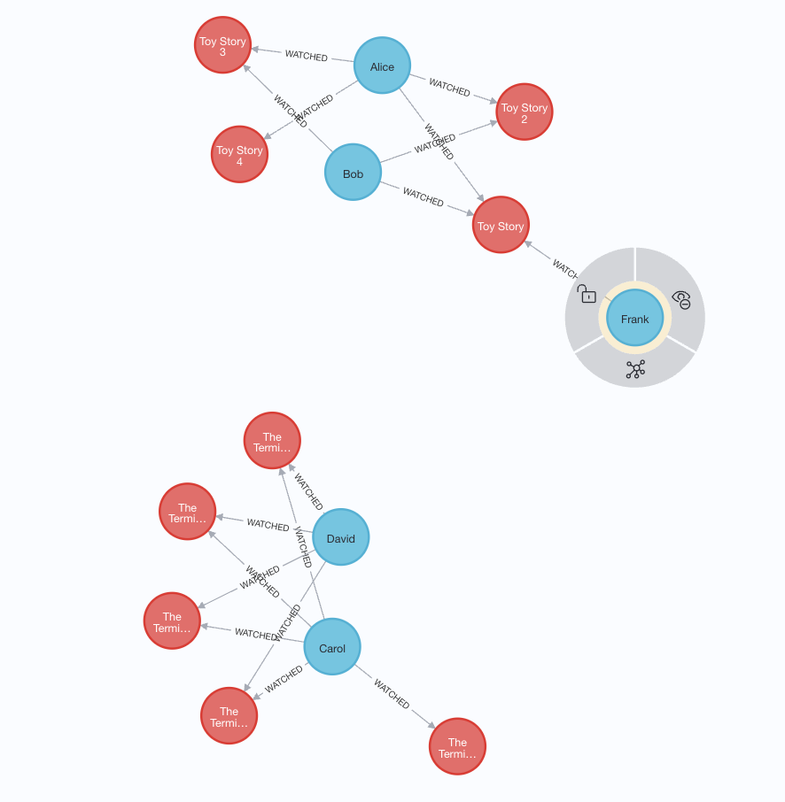

# Neo4j Recommendation System Example

An simple example of recommendation system using Neo4j as the backend.

## Usage

1. Create the Neo4j database:
```
$ create-neo4j-db.bash
```
2. Import the prepared dataset:
```
$ import-prepared-dataset.bash
```
3. Run the recommendation algorithm:
```
$ run-recommendation-algorithm.bash
```
4. Show the recommendation results:
```
$ show-recommendation-results.bash
```

## Configuration

You can modify `config.bash` to use your own dataset.

## Visualization

Please go on <http://localhost:7474/> and login the Neo4j Browser to see the visualization of the graph.
The username should be `neo4j` and the password is in `config.bash`.

## At a Glance



```
$ ./show-recommendation-results.bash
Showing current items for User:7788 from Neo4j database movie-recommender...
itemName
"Toy Story"
Showing Recommendation for User:7788 from Neo4j database movie-recommender...
itemName, totalScore
"Toy Story 2", 0.9849303364753723
"Toy Story 3", 0.9849303364753723
"Toy Story 4", 0.9701610803604126
"The Terminator 5", 0.4522900879383087
"The Terminator", 0.45043322443962097
"The Terminator 2", 0.45043322443962097
"The Terminator 3", 0.45043322443962097
"The Terminator 4", 0.45043322443962097
```
